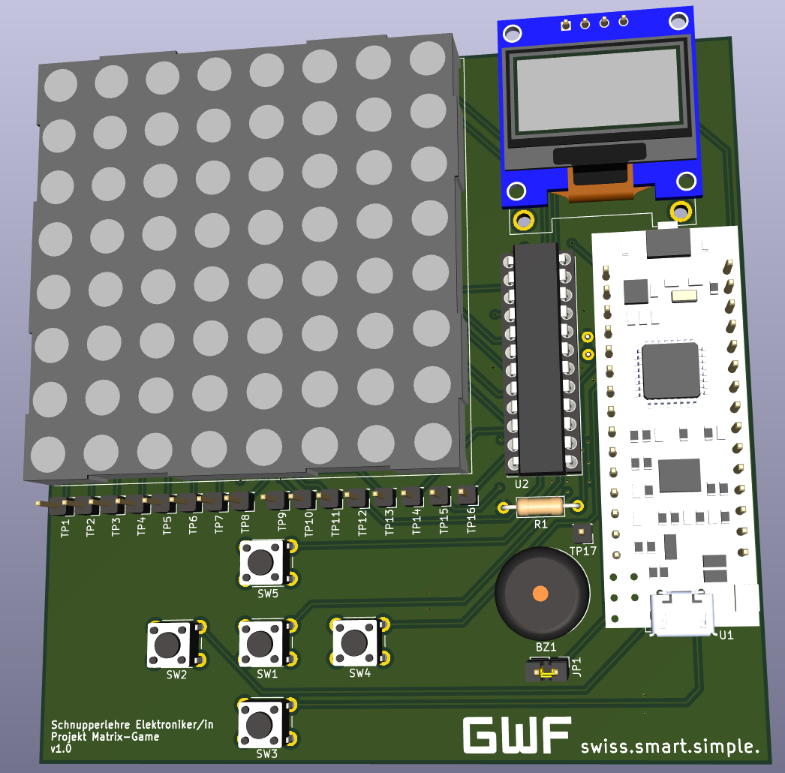

# Matrix-Game

Copyright (C) 2025 GWF AG, Obergrundstrasse 119, 6002 Lucerne, Switzerland

Contact: info@gwf.ch

## Trial Apprenticeship

This PCB is used as part of the trial apprenticeship for electronics/firmware at GWF AG in Lucerne.

_Deutsch: Schnupperlehre Elektroniker/in EFZ_

## Project

The project is used to practice soldering, measuring and potentially some coding.

The firmware currently supports the following games:
- [x] Snake
- [x] Tic-Tac-Toe

Feel free to submit a Pull Request to add more games! :tada:

## Changelogs

The changelogs can be find in the corresponding subdirectories:
- [Firmware Changelog](firmware/CHANGELOG.md)
- [Hardware Changelog](hardware/CHANGELOG.md)
